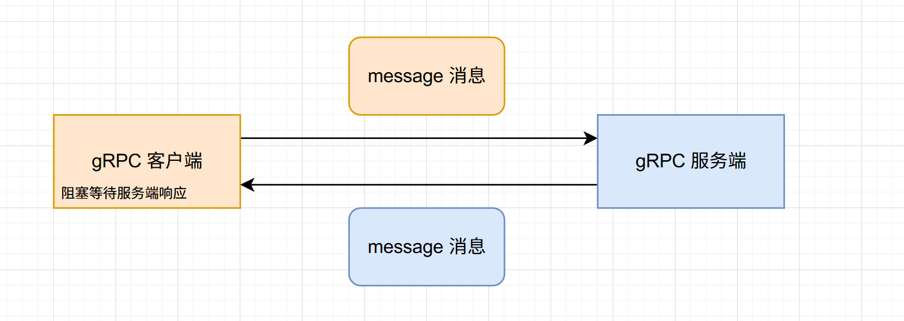
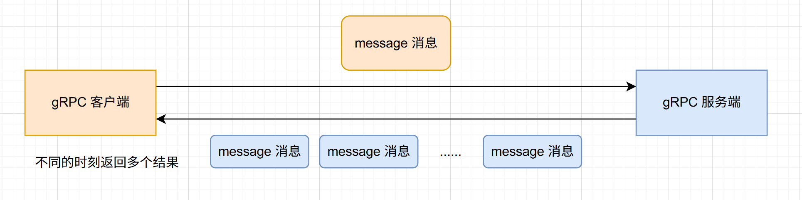
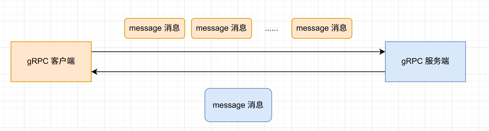
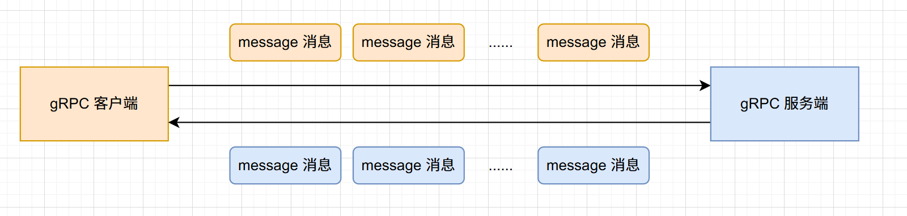

# gRPC

> @software: IntelliJ IDEA  
> @author: [Beau Dean](https://fairy.host)  
> @contact: [Blog](https://blog.fairy.host/) | [GitHub](https://github.com/FairylandTech) | [Telegram](https://t.me/FairylandFuture)  
> @organization: [GitHub·FairylandFuture](https://github.com/FairylandFuture)  
> @datetime: 2026-04-19 21:27:06 UTC+08:00

[](https://t.me/FairylandFuture) [](https://github.com/FairylandTech) [](https://interestingbooks.gitbook.io/) []() []() []() []() []() [](https://wakatime.com/@fa851759-c657-4b1e-8bcb-3ec3a693a2cd) [](https://github.com/FairylandTech)

---

# 定义

```protobuf
syntax = "proto3";

// 生成 Java 源文件是一个还是多个
option java_multiple_files = false;
// 生成的类放在那个包中
option java_package = "host.fairy";
// 生成 Java 外包类的名称，管理内部类才是真正开发使用的
option java_outer_classname = "First";

/*
定义 message
message 名称 {
  message关键字 字段类型 字段名称 = 编号（从1开始到2^29-1，19000-19999 protobuf 自己保留）
}

message 关键字 修饰字段
singular 默认 字段的值只能有0个或1个，0个就是 null，1个就是具体的内容。
repeated 字段的返回值是多个，等价于 Java 的 List。
*/

// 枚举的编号从0开始
enum Gender {
  MALE = 0;
  FEMALE = 1;
}

message LoginRequest {
  string username = 1;
  string password = 2;
  int32 age = 3;
  string email = 4;
}

message Result {
  string content = 1;
  string status = 2;
  repeated string tags = 3;
}

// message 消息嵌套
message SearchResponse {
  message Result {
    string url = 1;
    string title = 2;
  }

  string name = 1;
  Result data = 2;
}

// oneof 表示其中的一个。
message SimpleMessage {
  // content 传值只能是 string 或者是 bytes
  oneof content {
    string text = 1;
    bytes binaryData = 2;
  }
}


service HelloService {
  rpc hello(LoginRequest) returns (Result) {};
}
```

# gRPC 的四种通讯方式

## 简单RPC/一元RPC（Unary RPC）



## 服务端流式RPC（Server Streaming RPC）



**流式RCP需要长连接**

使用场景：

-   股票系统
    客户端发送一个股票的编号，服务端返回某时刻的股价

语法：

```protobuf
server StockService {
	// rpc关键字 方法名称 （请求参数） returns关键字 （stream关键字 响应参数）{}
    rpc getLiveStockPrice (Request) returns (stream Response) {}  // 流式 RPC
}
```

## 客户端流式RPC（Client Streaming RPC）



使用场景：

-   IOT（物联网【传感器】）

语法：

```protobuf
server IntellectDevice {
	// rpc关键字 方法名称 （stream关键字 Request） returns （Response）{}
	rpc send (stream Request) returns (Response) {}
}
```


## 双向流RPC （Bi-directional stream RPC）

客户端可以发送多个请求消息；服务端也可以响应多个响应消息



使用场景：

-   聊天室
-   IOT物联网

语法：

```protobuf
server Rotation {
	// rpc关键字 方法名称 （stream关键字 请求消息体） returns （stream 响应消息体） {};
	rpc rotationNews (stream SendRequest) returns (stream SendResponse) {};
}
```

# gRPC 的代理方式

## BlockingStub

特点：同步（阻塞）

## Stub

特点：异步（监听）

## FutureStub

特点：只能用于一元RPC，同步异步都支持

示例代码：

1.   protobuf

     ```protobuf
     /*****************************************************
      * @software: IntelliJ IDEA
      * @author: Beau Dean
      * @contact: https://fairy.host
      * @organization: https://github.com/FairylandFuture
      * @datetime: 2026-04-21 00:42:36 UTC+08:00
      ****************************************************/
     syntax = "proto3";
     
     option java_multiple_files = false;
     option java_package = "host.fairy.grpc";
     option java_outer_classname = "TestProto";
     
     message TestRequest {
       string requestMessage = 1;
     }
     
     message TestResponse {
       string responseMessage = 1;
     }
     
     service TestService {
       rpc testMethod (TestRequest) returns (TestResponse) {};
     }
     
     ```

2.   服务端

     ```java
     /*****************************************************
      * @software: IntelliJ IDEA
      * @author: Beau Dean
      * @contact: https://fairy.host
      * @organization: https://github.com/FairylandFuture
      * @datetime: 2026-04-21 00:45:39 UTC+08:00
      ****************************************************/
     package host.fairy.service.impl;
     
     import host.fairy.grpc.TestProto;
     import host.fairy.grpc.TestServiceGrpc;
     import io.grpc.stub.StreamObserver;
     import lombok.extern.slf4j.Slf4j;
     
     /**
      * @author Beau Dean
      * @version 1.0
      */
     @Slf4j
     public class TestServiceImpl extends TestServiceGrpc.TestServiceImplBase {
         @Override
         public void testMethod(TestProto.TestRequest request, StreamObserver<TestProto.TestResponse> responseObserver) {
             String requestMessage = request.getRequestMessage();
             
             TestProto.TestResponse response = TestProto.TestResponse.newBuilder()
                     .setResponseMessage("Received: " + requestMessage)
                     .build();
             
             try {
                 Thread.sleep(5000);
             } catch (Exception exception) {
                 log.error("Error: {}", exception.getMessage(), exception);
             }
             
             responseObserver.onNext(response);
             responseObserver.onCompleted();
         }
     }
     
     ```

3.   服务端

     ```java
     /*****************************************************
      * @software: IntelliJ IDEA
      * @author: Beau Dean
      * @contact: https://fairy.host
      * @organization: https://github.com/FairylandFuture
      * @datetime: 2026-04-21 00:47:49 UTC+08:00
      ****************************************************/
     package host.fairy;
     
     import com.google.common.util.concurrent.FutureCallback;
     import com.google.common.util.concurrent.Futures;
     import com.google.common.util.concurrent.ListenableFuture;
     import host.fairy.grpc.TestProto;
     import host.fairy.grpc.TestServiceGrpc;
     import io.grpc.ManagedChannel;
     import io.grpc.ManagedChannelBuilder;
     import lombok.extern.slf4j.Slf4j;
     
     import java.util.concurrent.Executors;
     import java.util.concurrent.TimeUnit;
     
     /**
      * @author Beau Dean
      * @version 1.0
      */
     @Slf4j
     public class TestProtoClient {
         private static final ManagedChannel CHANNEL = ManagedChannelBuilder.forAddress("localhost", 9000).usePlaintext().build();
         
         public static void main(String[] args) {
             sync();
             async();
             CHANNEL.shutdown();
         }
         
         public static void sync() {
             try {
                 TestServiceGrpc.TestServiceFutureStub testServiceFutureStub = TestServiceGrpc.newFutureStub(CHANNEL);
                 
                 ListenableFuture<TestProto.TestResponse> responseFuture = testServiceFutureStub.testMethod(TestProto.TestRequest.newBuilder()
                         .setRequestMessage("Future Stub")
                         .build());
                 
                 String responseMessage = responseFuture.get().getResponseMessage();
                 System.out.printf("Response message: %s\n", responseMessage);
             } catch (Exception exception) {
                 log.error("Error: {}", exception.getMessage(), exception);
             }
         }
         
         public static void async() {
             try {
                 TestServiceGrpc.TestServiceFutureStub testServiceFutureStub = TestServiceGrpc.newFutureStub(CHANNEL);
                 
                 ListenableFuture<TestProto.TestResponse> responseFuture = testServiceFutureStub.testMethod(TestProto.TestRequest.newBuilder()
                         .setRequestMessage("Future Stub")
                         .build());
                 
                 Futures.addCallback(responseFuture, new FutureCallback<TestProto.TestResponse>() {
                     @Override
                     public void onSuccess(TestProto.TestResponse result) {
                         System.out.printf("Response message: %s\n", result.getResponseMessage());
                     }
                     
                     @Override
                     public void onFailure(Throwable t) {
                         
                     }
                 }, Executors.newCachedThreadPool());
                 
                 System.out.println("后续的操作...");
                 CHANNEL.awaitTermination(10, TimeUnit.SECONDS);
             } catch (Exception exception) {
                 log.error("Error: {}", exception.getMessage(), exception);
             }
         }
     }
     
     ```
